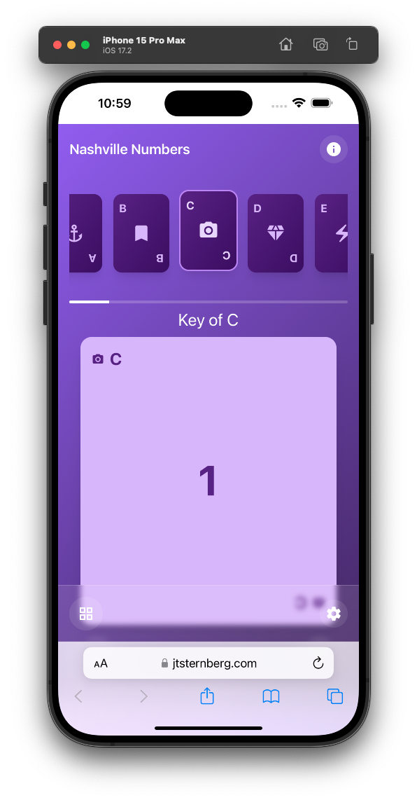

# Nashville Numbers Flashcard App

A Vue 3 + Vite application for learning and practicing Nashville Number System notation through interactive flashcards. This is a progressive web app (PWA) that can be installed on your device and used offline.

## Features

- Interactive flashcards with flip animation
- Keyboard navigation (space for flip, arrows for navigation)
- Touch support with swipe gestures
- Mobile-first responsive design
- PWA functionality for offline use
- Smooth animations and transitions

## Tech Stack

- Vue 3 with Composition API
- Vite for build tooling
- Pinia for state management
- Tailwind CSS for styling
- VueUse composables
- PWA support via vite-plugin-pwa

## Project Structure

## Accessibility

The app is built with accessibility in mind, featuring:
- Proper ARIA labels
- Keyboard navigation support
- Sufficient color contrast
- Screen reader compatibility

## Contributing

Contributions are welcome! Please ensure your code follows our style guidelines:
- Use Composition API with `<script setup>`
- Follow Vue 3 best practices
- Maintain mobile-first responsive design
- Keep components focused and single-responsibility
- Implement proper validation for props
- Use TypeScript for type safety

## License

This project is licensed under the MIT License - see the [LICENSE](LICENSE) file for details.
